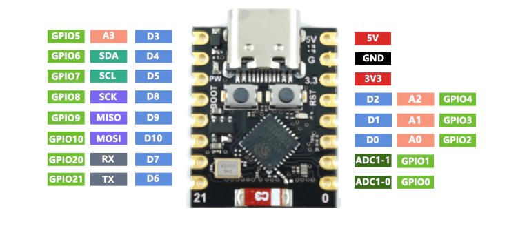

# Useless Box

The non-attributed and non-adapted work in this repository is licensed under the [MIT LIcense](https://opensource.org/license/mit).

All files in [adjusted folder](./resources/adjusted/) are apapted work from [@balassy](https://www.thingiverse.com/thing:3856965) 3D models on Thingiverse and are licensed under [CC BY-NC-SA 4.0](https://creativecommons.org/licenses/by-nc-sa/4.0/).

## Attribution

This concept and 3D model for the enclosure, mechanical and eletronic design is based on [useless-box](https://github.com/balassy/useless-box/) and [Smart Useless Box with ESP8266 and Gesture Sensor](https://www.thingiverse.com/thing:3856965).

All source code has been created from scratch.

3D Sketches available on [Thingiverse](https://www.thingiverse.com/thing:3856965), with [local copy](./resources/Smart%20Useless%20Box%20with%20ESP8266%20and%20Gesture%20Sensor%20-%203856965.zip) and extracted [here](./resources/originals/3d-print/). These files are licensed under [CC BY-NC-SA 4.0](https://creativecommons.org/licenses/by-nc-sa/4.0/) attributed to [György Balássy](https://www.thingiverse.com/balassy/designs).

The included [Fritzing schematics](./resources/originals/Useless-Box-Shield-v1.fzz) are directly from the [GitHub repository](https://github.com/balassy/useless-box/blob/master/wiring/Useless-Box-Shield-v1.fzz) and licesed under [MIT LIcense](https://opensource.org/license/mit) attributed to György Balássy ([@balassy](https://github.com/balassy)).

## Firnware

Using [ESP32-C3 Super Mini](https://ardustore.dk/produkt/esp32-c3-super-mini-wifi-4mb-ble5-udviklingsboard)

[Datasheet](./resources/ESP32C3%20Datasheet.PDF) from [ardustore.dk](https://ardustore.dk/error/ESP32C3%20Datasheet.PDF)

Pinout  from [arduinio.cc](https://forum.arduino.cc/t/esp32-c3-supermini-pinout/1189850)

See [ESP32-C3 Super Mini](https://www.sudo.is/docs/esphome/boards/esp32c3supermini/) on sudo.is.

[Generic ESP32-C3 firmware](https://micropython.org/download/ESP32_GENERIC_C3/).

Included parts for the Fritzing schematics:

* [ESP32-C3 Super Mini](./resources/esp32-c3-super-mini-tht.fzpz) (from [Fritzing Forum](https://forum.fritzing.org/t/need-esp32-c3-super-mini-board-model/20561) - [direct link](https://forum.fritzing.org/uploads/short-url/oE2T2GupmkPLZawp5EHPnzf3vFM.fzpz))
* [SG90](./resources/Tower%20Pro%20SG90%20servo.fzpz) which is compatible with the MG90S used in this design (from [SolderedElectronics/e-radionica.com-Fritzing-Library-parts-](https://github.com/SolderedElectronics/e-radionica.com-Fritzing-Library-parts-/tree/master) GitHub repo - [direct link](https://github.com/SolderedElectronics/e-radionica.com-Fritzing-Library-parts-/blob/master/Tower%20Pro%20SG90%20servo.fzpz))
* [APDS-9960](./resources/12787_sfe_apds_9960_rgb_and_gesture_sensor.fzpz) (from [sparkfun/Fritzing_Parts](https://github.com/sparkfun/Fritzing_Parts/tree/main/products) GitHub repo - [direct link](https://github.com/sparkfun/Fritzing_Parts/blob/main/products/12787_sfe_apds_9960_rgb_and_gesture_sensor.fzpz))
* [2 Pin Toggle Switch](./resources/Toggle%20Switch%20spst.fzpz) (from [Fritzing Forum](https://forum.fritzing.org/t/special-type-of-spst-part/6125) - [direct link](https://forum.fritzing.org/uploads/default/original/2X/1/1c25cedde9474dec93b1165daffaadfd2b2697d7.fzpz))

### Flash

```sh
brew install esptool
```

or

```sh
pip install esptool
```

Flash ESP32:

```sh
esptool.py --chip esp32c3 --port /dev/cu.usbmodem1452201 erase_flash
esptool.py --chip esp32c3 --port /dev/cu.usbmodem1452201 --baud 460800 write_flash -z 0x0 ./firmware/ESP32_GENERIC_C3-20240602-v1.23.0.bin
```

## Components

* 1 mini breadboard
* 1 x [ESP32-C3 Super Mini](https://ardustore.dk/produkt/esp32-c3-super-mini-wifi-4mb-ble5-udviklingsboard)
* 2 x [MG90S](https://www.amazon.de/dp/B095YVLLFQ) this is compatible with the original SG90, but is more robust (metal gears) and quieter
* 1 x [APDS-9960](https://www.amazon.de/dp/B01HV41XJO) ([library](https://github.com/liske/python-apds9960))
* 1 x [2 Pin Mini On/Off Toggle Switch](https://www.amazon.de/dp/B07MS8X99G)
* 1 x 1 kΩ resistor (color code Brown-Black-Red-Gold for reference)
* Various M2 and M3 screws, nuts and washers

## 3DPrinted Box

The original files from [balassy](https://www.thingiverse.com/thing:3856965) has been adjusted to accomodate the slightly larger controller on a mini breadboard (with extended). Additionally the micro USB port has been adjusted size and position for the USB-C port on the used ESP-C3 Super Mini.

Additionally mounts have been added to the box bottom, to allow for better mounting of the servo for the lid on the box-base, using 2 M2 screws.

## Useless-Box Behavior Overview

This version of the useless-box has a controller which manages the behavior/response of the useless-box to stimuli/input. The implemented behaviors are:

### 1. Initial Setup and Idle State

* **When the program starts**, the controller initializes the box components, including the switch arm, lid arm, proximity sensor, toggle switch, and LED.
* The system enters the **IDLE** state initially, waiting for any user interaction (such as the proximity of a hand or the toggle switch being activated).

### 2. Monitoring and Responding to Proximity and Switch State

* The `update()` method continuously monitors the proximity sensor and the state of the toggle switch.
* The box reacts based on proximity levels (`VERY_CLOSE`, `CLOSE`, or `FAR`) and the toggle switch state (`On` or `Off`). Here's how each condition is handled:

### 3. Switch State Changes

* **If the toggle switch is turned on** (`current_switch` becomes `True`):
  * The system enters the `SWITCH_OFF` state.
  * The LED is turned **on** to signal the activation.
  * A **random delay** (shorter or longer, with more frequent short delays) is introduced before switching off the toggle.
  * The `_handle_switch_toggle()` method is called, which:
    * Opens the lid.
    * Attempts to switch off the toggle. If it fails, it retries up to three times.
    * Retracts the switch arm and closes the lid afterward.
  * The LED is turned **off** again, and the state resets to **IDLE**.

### 4. Proximity: Very Close Interaction

* **If a hand is detected very close** (`ProximityState.VERY_CLOSE`) and the box is in the `IDLE` state:
  * There is a **5% chance** of the box playing a **peek-a-boo** animation:
    * The lid opens slightly and then closes.
  * There is also a **20% chance** of the box threatening to turn off the toggle:
    * The switch arm moves to a halfway position as if threatening, then retracts.
  * If neither occurs, the box simply acknowledges the hand's presence but does nothing more.

* **If the lid is already open** when the hand is very close:
  * The box ensures the lid stays closed to prevent any tampering.
  * Occasionally, it might perform a **peek-a-boo** with a **1% probability**.
  * The LED blinks slowly when the hand is very close.

### 5. Proximity: Close Interaction

* **If a hand is detected close** (`ProximityState.CLOSE`) and the box is in the `IDLE` state:
  * There is a **30% chance** the box will perform a **fake-out**:
    * The lid opens slightly and quickly closes.
  * Otherwise, it enters the `TEASING` state and performs a teasing animation:
    * The lid opens to a random angle (50% to 100%), pauses, and then closes.

### 6. Proximity: Far Interaction

* **If the hand moves away** (`ProximityState.FAR`) and the box is not in the `IDLE` state:
  * The box returns to the **IDLE** state.
  * The LED is turned **off**.
  * The lid is closed if it is open, and the switch arm is retracted.

### 7. Inactivity Timeout

* The box monitors the duration since the last interaction. If the time exceeds the set `inactivity_timeout` (5 seconds in this case):
  * If the lid is open (`LID_OPEN` state), the box closes the lid and retracts the switch arm to its default position.

### 8. Panic Mode

* **If the user toggles the switch repeatedly** (three times within three seconds):
  * The box enters **panic mode**, where it:
    * Rapidly opens and closes the lid while blinking the LED for five cycles.
  * The state returns to **IDLE** after the panic mode completes.

### 9. LED Behavior Based on Proximity

* The LED behavior is tied to proximity:
  * **Very Close**: LED blinks slowly (on for half a second, off for half a second).
  * **Close**: LED blinks rapidly (on for 0.1 seconds, off for 0.1 seconds).
  * **Far**: LED remains off.

### Summary

* The `UselessBoxController` reacts dynamically based on the proximity of a hand and the toggle switch state. It performs quirky behaviors like teasing, fake-outs, peek-a-boo, threatening gestures, and panic mode to entertain and surprise users.
* The randomness introduced (through probabilities and delays) ensures that the box feels unpredictable and playful, making interactions more engaging.
* The box also incorporates safety measures, such as ensuring the lid stays closed when the hand is too close and resetting states after inactivity, providing a consistent user experience.

## Additional Works

* [Useless Box PRO with ESP8266 and Gesture Sensor](https://www.thingiverse.com/thing:5787968) remix from original
